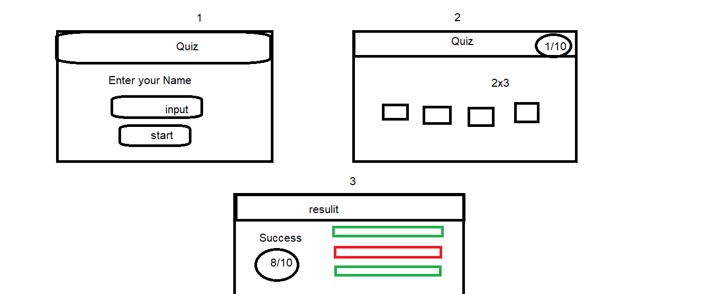

# Quiz-Team-12
Quiz Team 12 Project

-[Wireframe](#wireFrame)
-[Design](#design)
-[Description](#description)
-[Build with](#buildWith)
-[Features](#features)
-[User journey](#userJourney)
-[User stories](#userStories)
-[Links](#links)
-[Mentor](#mentor)
-[Team members](#teamMember)
# Wire Frame  

## Figma Link 
 [click Here](https://www.figma.com/file/PghY0VWwBeCFAopIk4Lcep/Untitled?node-id=0%3A1)

# Description  
Our website is the perfect website for Quiz and exiams providing Math questions

## Features  
- Simple UI
# Build with  
- HTML
- CSS
- JavaScript
- Local Storage

# User Journey  
**First** 
when the user enter the website landing page will show up landing page must the user add the name and read the details 

**Second** when user click start will show up the questions

**Third**  in the questions page after answer the questions will show up button Next to switch to next question

**Fourth** After end the Quiz will show up a button has a title Exit

## User Stories  
* as a user i should be able to search about any character
* as a user i should be able to see the skins of the champion. 
* as a user i should be able to see the details of the character. 

* As a User, I want to be able to open the app page and see a brief description of the game and how to play.
* As a User, I should be able to check the leaderboard that contains the high score with the name of the players.
* As a User, I should have a button to start the game.
* The game should ask the player to enter his/her name.
* The game should give 10 random MC questions to the user with 4 options to each question(only one right answer).
* As a User, I want to have a button to move to the next question after answering the current question.
* The next question button should only appear/activate after answering the question.
* As a User, I should be able to see how many questions I still have to answer(2/10 meaning that I am on the second question).
* As a User, I should be able to see my score after finishing all of the questions.

## Link  
- You can visit our Website by [clicking here](https://ca-g12.github.io/Quiz-Team-12/)
## How do I get the project on my local machine?
### You can get the project in your local machine:-

- git clone `https://github.com/CA-G12/Quiz-Team-12.git`

- cd Quiz-Team-12
- go live server

## Team members:  
- [Zayan Alaraishy](https://github.com/Zayan-Alaraishy)
- [Mohammed Al-Shorafa](https://github.com/mohmmed23)
- [Nader shakshak](https://github.com/nadershakshak)
